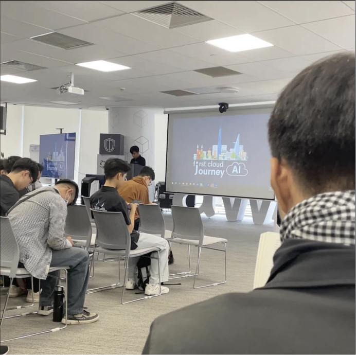

# Event Report: "AWS First Cloud Journey - Event 1" (06/06/2026)

### Event Objectives
- Explore modern approaches to cloud security and network intrusion detection.
- Gain deeper insights into containerization technologies for efficient application deployment and management.
- Learn from industry professionals about career development from system administration to Cloud and DevOps.
- Understand real-time connection architectures for multiplayer applications on AWS.
- Discover advanced Artificial Intelligence solutions, particularly GraphRAG for enhancing Retrieval-Augmented Generation (RAG) systems.

### Speakers
- **Lê Hoàng Gia Đại** – Presented on AWS WAF and Machine Learning-based Network Intrusion Detection Systems (NIDS).
- **Bao Huynh** – Junior Cloud Native Developer, presented on Docker and containerization.
- **Tran Trung Vinh** – System Administrator at Central Retail Group, shared his career journey in IT.
- **Nguyen Quoc Bao** – Demonstrated how to connect Godot clients with AWS WebSockets.
- **Viet Phat** – Presented GraphRAG architecture using Amazon Bedrock and Amazon Neptune.

### Key Takeaways

#### Intelligent Security with AWS WAF and Machine Learning (NIDS)
- Traditional WAF solutions rely on predefined rules, making them less effective against zero-day attacks and emerging threats.
- Machine Learning-based NIDS, trained on datasets such as CSE-CIC-IDS2018, can continuously learn and detect previously unseen attack patterns.
- The proposed architecture integrates AWS services including API Gateway, Lambda, Kinesis Data Firehose, and GuardDuty for real-time monitoring and threat detection.

#### Containerization with Docker
- Docker addresses many limitations of traditional virtual machines, which require dedicated operating systems and consume significant computing resources.
- Containers share the host operating system, making them lightweight, fast to start, and capable of eliminating environment inconsistencies.
- Docker image layers improve build efficiency by reusing cached layers whenever possible.

#### Career Journey: From System Administrator to DevOps
- A strong foundation in IT Helpdesk and system troubleshooting is essential before advancing to Linux, networking, and cloud technologies.
- Modern cloud engineering emphasizes Infrastructure as Code (e.g., Terraform), CI/CD pipelines, and DevOps practices to automate repetitive tasks.
- Practical project experience and real-world troubleshooting skills are often more valuable than certifications alone.

#### Real-Time Multiplayer Architecture on AWS
- WebSocket is well suited for applications requiring continuous bidirectional communication, providing lower latency than HTTP polling while maintaining reliable communication.
- The demonstrated architecture combines Godot, API Gateway, AWS Lambda, and DynamoDB to implement matchmaking and player state management.
- Although the serverless approach provides excellent scalability, developers should carefully consider state management limitations and DynamoDB scan costs.

#### Enhancing RAG with GraphRAG
- Traditional Retrieval-Augmented Generation (RAG) struggles to capture complex relationships spanning multiple documents.
- GraphRAG addresses this limitation through multi-hop reasoning and knowledge graph structures that explicitly model relationships between entities.
- The solution can be implemented using managed services such as Amazon Bedrock Knowledge Bases and Neptune Analytics or through custom frameworks like LlamaIndex.

### Knowledge Gained

#### Design Thinking
- **Operations Mindset:** Every production system should include monitoring, automation, and strict policies to avoid testing directly in production environments.
- **Architecture Based on Requirements:** Technology selection should always be driven by system requirements, such as choosing WebSocket over HTTP polling for real-time matchmaking.

#### Technical Knowledge
- Learned how asynchronous data flows are processed through API Gateway, AWS Lambda, and DynamoDB.
- Understood the complete machine learning workflow, including data cleaning, preprocessing, and handling class imbalance for intrusion detection.
- Gained insights into knowledge graph construction for improving semantic retrieval and multi-hop reasoning in large language model applications.

#### Career Development
- Modern infrastructure development should prioritize automation through Docker, CI/CD pipelines, and Infrastructure as Code.
- Cloud-native architectures offer excellent scalability but also require effective monitoring strategies and cost optimization practices.

### Applications to My Project
- Apply GraphRAG with LlamaIndex and vector databases to enhance the NewsRAG platform by improving multi-hop retrieval and semantic reasoning over news articles.
- Use Docker to containerize Kafka services and PostgreSQL databases, ensuring consistent development environments for the ETL pipeline and data warehouse.
- Explore AWS Lambda and Kinesis Data Firehose as components for building automated streaming data pipelines that support future analytics and dashboard systems.

### Event Experience

Attending the **AWS First Cloud Journey** event significantly broadened my understanding of how modern cloud technologies are transforming software development, system operations, and data management.

The presentation that impressed me the most was **Docker and Containerization** by Bao Huynh. The comparison between traditional virtual machines and lightweight containers clearly demonstrated why containerization has become the standard approach for modern application deployment. Since environment consistency is one of the biggest challenges when developing data-intensive systems, Docker's fast startup time, efficient resource utilization, and image layer caching provide an effective solution for standardizing complex development workflows.

In addition, the event provided a comprehensive overview of how different cloud technologies work together. Topics ranging from machine learning-based security, real-time communication through WebSockets, to GraphRAG for advanced AI reasoning highlighted the importance of building a solid data foundation. The speakers' practical experiences and career advice also reinforced the value of continuous learning, hands-on practice, and adopting an engineering mindset for future career development.

#### Event Photos
