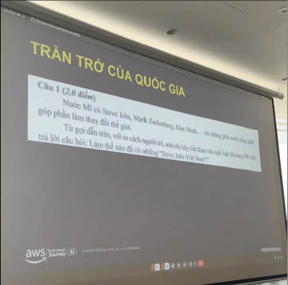
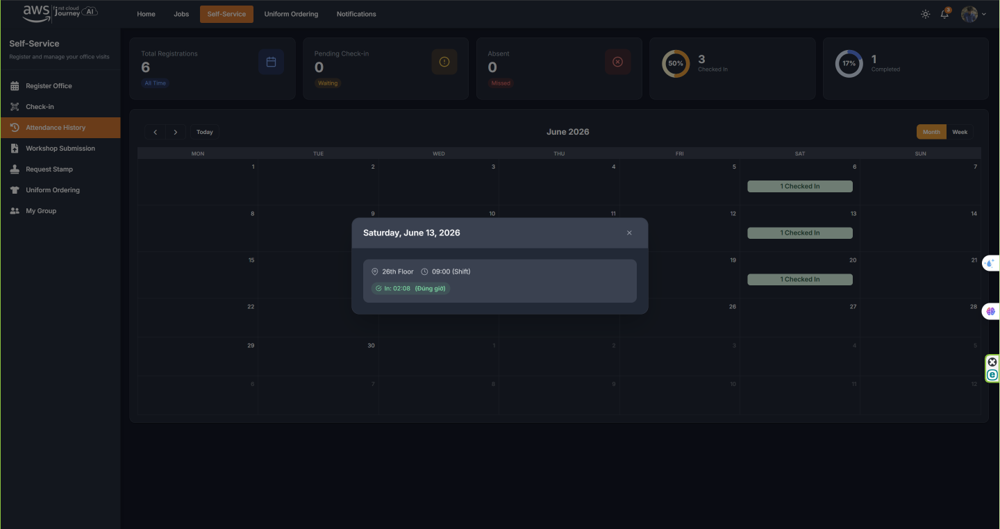

# Event Report: "AWS First Cloud Journey - 13/06 Event"

### Event Objectives
- Explore the working environment, recruitment process, and culture of multinational corporations (MNCs).
- Learn about the career journey from a curious university student to becoming an AWS Partner.
- Understand the realities of a DevOps career and build a solid technical foundation for long-term professional growth.

### Speakers
- **Dat Pham & Cuong Nguyen** – Data Analytics Engineer and Process Engineer, shared insights into the mindset and culture of multinational corporations.
- **Danh Hoang Hieu Nghi** – AI Engineer and AWS Community Builder, presented the topic *"From First Cloud AI Journey to AWS Partner"*.
- **Trong Truong** – DevOps Engineer at Endava Vietnam, presented *"What Does a DevOps Engineer Really Do?"*.

### Key Takeaways

#### Working Culture in Multinational Corporations (MNCs)
- The role of a Data Analytics Engineer extends beyond generating reports; it also involves designing dashboards, identifying root causes, and collaborating across departments to solve business problems.
- Many multinational companies embrace a **No-Blame Post-Mortem** culture, where engineers focus on identifying and fixing system issues rather than assigning blame to individuals.
- Career progression can be viewed through five stages of professional growth: **Follower → Learner → Problem Solver → System Thinker → Super Star**. At the System Thinker level, engineers evaluate problems from a holistic perspective while considering operational risks and long-term optimization.

#### Growing with the AWS Community
- A recommended eight-step career roadmap includes: **Student Curiosity → First Cloud Journey → Community Learning → Hands-on Practice → Real Projects → Portfolio Development → AWS Partner → Share Back**.
- Programs such as the AWS Student Builder Group and AWS Community Builder provide valuable opportunities to gain certifications, AWS credits, and expand professional networks.

#### Understanding the Reality of DevOps
- There is a significant difference between the common perception of DevOps (CI/CD, Docker, Kubernetes, and deployments) and the actual responsibilities, which include on-call support, troubleshooting staging environments, cloud cost optimization, and ownership of operational issues.
- The demand for Cloud and DevOps engineers in Vietnam continues to grow, accompanied by highly competitive salaries.
- The most important skills are not specific tools but strong fundamentals in Linux, Networking, and programming languages such as Python and Go.

### Knowledge Gained

#### Design Thinking & Problem Solving
- In data-related fields, critical thinking and **storytelling with data** are essential for transforming raw numbers into meaningful business insights.
- Effective DevOps engineers adopt a **systems thinking** mindset rather than focusing solely on isolated technical tasks.
- Repetitive tasks should be automated, and systems should be designed to be maintainable and accessible for the entire team.

#### Technical Knowledge
- Simply copying commands is very different from understanding how a system actually works.
- The most effective learning approach is to build small projects, deploy applications, automate workflows, implement monitoring, intentionally break the system, and then troubleshoot and fix it.
- Artificial Intelligence should be used as a tool to enhance learning and productivity rather than replacing critical thinking.

#### Career Development Strategy
- Rather than focusing on job titles, engineers should prioritize developing the mindset and skills required to consistently deliver high-quality results.
- Communication is an essential part of technical work, and sharing knowledge with the community is one of the best ways to reinforce personal growth.

### Applications to My Work and Studies
- Apply **storytelling with data** principles to current Data Warehouse and ETL projects so that processed data delivers meaningful insights instead of merely being clean and structured.
- Follow the principle of **mastering the fundamentals** when working with containerized systems by understanding Linux internals and networking instead of relying solely on existing templates.
- Actively participate in communities such as the AWS Student Builder Group to gain practical experience and strengthen incident-handling and system engineering skills.

### Event Experience

Attending the meetup on **June 13** provided valuable insights into both career development and the realities of working in the technology industry.

The session that impressed me the most was the discussion on **corporate culture in multinational companies (MNCs)**. A professional working environment requires not only strong technical skills but also an open and collaborative mindset. The concept of **No-Blame Post-Mortem**, which emphasizes identifying and resolving root causes instead of blaming individuals, stood out as an especially valuable engineering practice. When developing complex software systems or data platforms, bugs and unexpected issues are inevitable. Adopting a no-blame culture, together with empathy and inclusiveness, helps create a healthy environment where team members can collaborate effectively, continuously improve systems, and learn from failures.

Another inspiring takeaway was the **five-level professional growth model**. Moving beyond simply completing assigned tasks toward becoming a **System Thinker**—someone who understands the entire system, evaluates operational risks, and designs long-term solutions—is the career direction I aspire to pursue as I continue developing as a software engineer.

#### Event Photos

