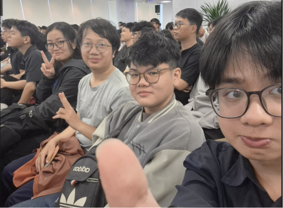

# Bài thu hoạch sự kiện “Agentic AI Build Week - Hackathon - 25/07”

### Mục Đích Của Sự Kiện
- Thử thách giới hạn của bản thân thông qua việc xây dựng một sản phẩm Minimum Viable Product (MVP) hoàn chỉnh từ đầu đến cuối dưới áp lực thời gian cực lớn (24 giờ).
- Cọ xát thực tế với các công nghệ Trí tuệ Nhân tạo hiện đại nhất, đặc biệt là việc tích hợp Agentic AI vào hệ sinh thái điện toán đám mây AWS.
- Trải nghiệm quy trình làm việc nhóm cường độ cao: từ khâu định hình ý tưởng, vượt qua khủng hoảng kỹ thuật (bugs, tích hợp hệ thống), cho đến kỹ năng thuyết trình (pitching) trước ban giám khảo.

### Danh Sách Các Đội Và Dự Án Tiêu Biểu
- **Team 3KA** (Huynh An Khuong, Nguyen Quoc Huy,...): Dự án S.H.E.P.H.E.R.D - Hệ thống phân tích và giám sát đám đông.
- **Team Plan V** (Pham Tien Thuan Phat, Huynh Hoang Long,...): Dự án SA Professional AI Native App - Trợ lý AI thiết kế kiến trúc hệ thống.
- **Dream AI Team** (Le Tan Luc, Do Hoang Hieu,...): Dự án Signal Scout - Nền tảng phân tích chiến lược doanh nghiệp.

### Nội Dung Nổi Bật

#### S.H.E.P.H.E.R.D: Giám sát luồng người bằng AI
- Giải quyết bài toán quá tải tại các sự kiện bằng cách biến camera thông thường thành hệ thống cung cấp thông tin vận hành theo thời gian thực.
- Hệ thống kết hợp Computer Vision (YOLO + ByteTrack) để theo dõi mật độ đám đông, cùng Amazon SageMaker và Bedrock Agent để dự đoán rủi ro tắc nghẽn và tự động cảnh báo cho nhân viên điều phối.
- Đội thi đã vượt qua rào cản chưa có nền tảng về AI và kinh nghiệm AWS trước đó để hoàn thành hệ thống chỉ trong 24 giờ.

#### SA Professional AI Native App: Tự động hóa thiết kế kiến trúc
- Nhắm vào "nỗi đau" của các Solution Architect khi phải đọc tài liệu yêu cầu (BRD) thủ công và vẽ kiến trúc từ con số 0.
- Ứng dụng tự động phân tích ngôn ngữ tự nhiên từ tài liệu, phác thảo kiến trúc lai (hybrid-cloud), sinh ra sơ đồ Draw.io qua Model Context Protocol (MCP), và xuất thẳng mã cơ sở hạ tầng (Terraform IaC).
- Đặc biệt, hệ thống còn tự động tính toán bảng dự toán chi phí AWS chi tiết cho từng dịch vụ như EC2, RDS, S3.

#### Signal Scout: Khai phá dữ liệu chiến lược
- Tạo ra công cụ hỗ trợ quyết định bằng cách thu thập, xác thực và xâu chuỗi các "tín hiệu" rời rạc từ công chúng thành một bức tranh chiến lược kinh doanh toàn cảnh.
- Tận dụng sức mạnh của Amazon Bedrock và AgentCore Short-Term Memory để phân tích các chỉ số tài chính, giúp khách hàng đưa ra quyết định duy trì, thích ứng hay tăng tốc.
- Đội thi đã trình bày bảng phân tích chi phí triển khai cực kỳ chi tiết, tối ưu hóa các dịch vụ (Lambda, DynamoDB, WAF) để duy trì ngân sách vận hành ở mức rất hiệu quả (khoảng $81 - $359).

### Những Gì Học Được

#### Tư Duy Thiết Kế & Quản Lý Dự Án
- **Triết lý hoàn thiện**: Nhận thức sâu sắc rằng "một tính năng nhỏ hoàn thiện còn hơn một ý tưởng lớn nhưng hỏng hóc" (Small, finished work beats big, broken ideas). Việc khoanh vùng phạm vi dự án thật nhỏ (scope it tiny) và định nghĩa rõ tiêu chuẩn "hoàn thành" từ sớm là phương pháp tiếp cận hoàn hảo để quản lý tiến độ.
- **Sự chuẩn bị kỹ lưỡng**: Làm việc dưới áp lực thời gian cực lớn đòi hỏi sự phân chia vai trò rõ ràng và các thiết lập tài khoản, môi trường (starter templates) phải sẵn sàng từ trước.

#### Kiến Trúc Kỹ Thuật (AWS & AI)
- **Kiến trúc xử lý luồng dữ liệu thời gian thực (Real-time Inference):** Hiểu rõ cách tích hợp các mô hình Computer Vision (như YOLO và ByteTrack) với **Amazon SageMaker** để phân tích luồng video trực tiếp, đo lường mật độ đám đông và dự đoán độ tắc nghẽn. Việc giải quyết độ trễ suy luận (inference latency) mang lại bài học đắt giá để tối ưu hóa tốc độ nhập liệu thời gian thực (real-time data ingestion).
- **Kiến trúc Agentic AI đa tầng:** Nắm bắt cách thiết lập hai luồng Agent hoạt động song song. Một "Autonomous Monitor" làm nhiệm vụ liên tục giám sát, phát hiện sự cố để chủ động gửi cảnh báo, kết hợp với một "Operator Copilot" được triển khai qua **Amazon Bedrock Agent** cho phép người dùng truy vấn dữ liệu vận hành bằng ngôn ngữ tự nhiên.
- **Mô hình Container & Network Bảo mật:** Học được cách thiết kế mạng lưới đám mây an toàn với **Amazon VPC**, sử dụng Public Subnet cho CloudFront/ALB và Private Subnet để bảo vệ cơ sở dữ liệu PostgreSQL. Các Backend và Agent được đóng gói độc lập và chạy trên **Amazon ECS (Fargate)**, củng cố sức mạnh của công nghệ container hóa thay vì triển khai máy chủ vật lý truyền thống.
- **Tối ưu hóa luồng gọi API và Chi phí:** Khám phá cách các công cụ AI giao tiếp với AWS thông qua kiến trúc Model Context Protocol (MCP). Đồng thời, học cách kết hợp **AWS Lambda**, **Amazon DynamoDB** và API Gateway để xây dựng nền tảng dữ liệu với chi phí vận hành siêu tối ưu (chỉ từ 17 USD đến 130 USD/tháng cho các dịch vụ cốt lõi).

### Ứng Dụng Vào Công Việc & Học Tập
- Tích hợp kiến trúc Agentic AI có khả năng sinh mã IaC (Terraform) từ dự án Plan V để tự động hóa việc triển khai môi trường container (Docker) và hệ thống cơ sở dữ liệu phân tán. Điều này giúp rút ngắn đáng kể thời gian thiết lập hạ tầng cho các dự án mới.
- Vận dụng cơ chế xử lý và phân tích luồng dữ liệu thời gian thực từ dự án S.H.E.P.H.E.R.D vào việc tối ưu hóa các pipeline ETL, đảm bảo khả năng thu thập và cảnh báo độ trễ dữ liệu ngay lập tức.
- Áp dụng nguyên tắc "scope it tiny" của Hackathon vào các sprint làm việc hàng ngày: chia nhỏ các module phức tạp thành các tính năng độc lập, dứt điểm từng phần để duy trì tiến độ ổn định.

### Trải nghiệm trong event

Điểm ấn tượng và truyền cảm hứng nhất đối với tôi thuộc về hành trình của đội 3KA với dự án **S.H.E.P.H.E.R.D**. Vượt qua nỗi sợ hãi vì không có nền tảng AI vững chắc và chưa từng làm việc với AWS trước đó, đội đã chứng minh sức mạnh của sự bền bỉ. Những thách thức kỹ thuật như duy trì độ ổn định của luồng video trực tiếp, đảm bảo khả năng theo dõi đối tượng giữa các khung hình (frames) hay giải quyết độ trễ suy luận đều được xử lý gọn gàng. Hình ảnh cả nhóm cùng nhau uống 5 lon Redbull, ăn KFC, quên commit code, hay debug miệt mài đến tận 3 giờ sáng mang lại sự đồng cảm sâu sắc.

Cách S.H.E.P.H.E.R.D biến một camera thông thường thành một hệ thống cảnh báo vận hành thông minh bằng Computer Vision và Agentic AI không chỉ giải quyết triệt để vấn đề nhân sự tại các sự kiện đông người, mà còn gợi ra vô số ý tưởng thiết kế hệ thống điều khiển tự động cho các lĩnh vực khác trong tương lai.

#### Một số hình ảnh khi tham gia sự kiện
