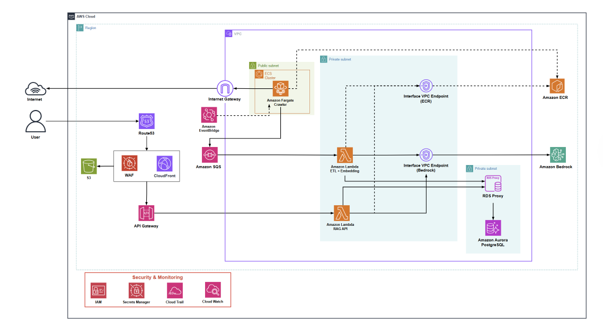

# 5.3 Triển khai Hạ tầng (Infrastructure)

Dưới đây là chi tiết kiến trúc hạ tầng Serverless Hướng sự kiện (Event-Driven) trên AWS cho nền tảng News RAG. Toàn bộ các dịch vụ này sẽ được thiết lập và cấu hình trực tiếp thông qua giao diện AWS Management Console.

## 1. Mạng & Bảo mật (Networking & Security)
Hệ thống được đặt trong một Mạng riêng ảo (VPC) để đảm bảo cô lập dữ liệu và bảo mật tuyệt đối:
*   **VPC (Virtual Private Cloud):** Tạo một Custom VPC với dải IP riêng (ví dụ: `10.0.0.0/16`).
*   **Subnets (Mạng con):** 
    *   **Public Subnet:** Nơi đặt container cào dữ liệu **Amazon Fargate Crawler**. Subnet này được kết nối trực tiếp với **Internet Gateway**, cho phép Crawler truy cập Internet để cào tin tức mà hoàn toàn **không cần sử dụng NAT Gateway** (giúp tối ưu hóa tối đa chi phí hạ tầng).
    *   **Private Subnet:** Nơi chứa các tài nguyên cốt lõi cần được bảo vệ, không cho phép truy cập trực tiếp từ Internet, bao gồm Database Aurora và các hàm Lambda.
*   **Interface VPC Endpoints (PrivateLink):** Sử dụng các Endpoints này để các hàm Lambda (đang nằm trong Private Subnet) có thể giao tiếp bảo mật với các dịch vụ AWS khác (như ECR, Bedrock) hoàn toàn thông qua mạng nội bộ AWS.
*   **Security Groups:** Thiết lập quy tắc tường lửa (Firewall) nghiêm ngặt, chỉ cho phép luồng dữ liệu đi qua các cổng cần thiết (ví dụ: chỉ cho phép Lambda truy cập port 5432 của RDS Proxy/PostgreSQL).

## 2. Lưu trữ & Cơ sở dữ liệu (Storage & Database)
*   **Amazon Aurora PostgreSQL Serverless v2:** Đóng vai trò là Data Warehouse trung tâm. Nó lưu trữ siêu dữ liệu bài viết (Star Schema) và lưu trữ Vector Embeddings (thông qua extension `pgvector` với chỉ mục HNSW).
*   **Amazon RDS Proxy:** Đứng giữa các hàm Lambda và Aurora Database để quản lý Connection Pool. Nó ngăn chặn tình trạng quá tải hoặc cạn kiệt kết nối khi SQS kích hoạt hàng loạt hàm Lambda chạy đồng thời.
*   **Amazon ECR (Elastic Container Registry):** Nơi lưu trữ an toàn các private Docker Image của hệ thống cào dữ liệu (Scrapy) để Fargate kéo về mỗi khi khởi chạy.

## 3. Thu thập dữ liệu & Hàng đợi (Ingestion & Queue)
*   **Amazon ECS Fargate:** Chạy tác vụ cào dữ liệu (Crawler) dưới dạng container Serverless. Nằm ở Public Subnet để đi thẳng ra Internet qua Internet Gateway. Cấu hình sử dụng mức tài nguyên nhỏ nhất (0.25 vCPU, 0.5GB RAM). Khi cào xong tin tức trong ngày (khoảng 5 phút), Fargate sẽ tự động tắt.
*   **Amazon SQS (Simple Queue Service):** Hàng đợi tiêu chuẩn (Standard Queue) đóng vai trò làm bộ đệm (Buffer). Nó nhận dữ liệu thô từ Fargate và ngay lập tức kích hoạt (Trigger) hàm Lambda ETL để xử lý tiếp.
*   **Amazon EventBridge Scheduler:** Hoạt động như một Cronjob tự động, được thiết lập để đánh thức ECS Fargate chạy tác vụ cào tin tức mỗi ngày vào một khung giờ cố định.

## 4. Xử lý tính toán (Compute)
Sử dụng AWS Lambda để xử lý logic với chi phí tính theo từng mili-giây hoạt động:
*   **Lambda ETL (`newsrag-etl`):** Được kích hoạt tự động theo cơ chế Event-driven ngay khi SQS có tin mới. Hàm này nhận raw HTML, kiểm tra trùng lặp (SHA256), làm sạch văn bản, phân đoạn (Chunking 500 tokens), gọi Bedrock tạo Vector, và lưu vào Aurora.
*   **Lambda RAG API (`newsrag-rag-api`):** Nhận câu hỏi từ người dùng, nhúng câu hỏi thành vector, thực hiện tìm kiếm mức độ tương đồng (Cosine Similarity) trong Aurora, và tổng hợp Prompt để gọi LLM sinh câu trả lời.

## 5. API, Phân phối & Trí tuệ nhân tạo (AI)
*   **Route53, CloudFront & WAF (Tuỳ chọn/Mở rộng):** Phân giải tên miền, phân phối nội dung (CDN) và bảo vệ API khỏi các cuộc tấn công web độc hại.
*   **Amazon API Gateway:** Cung cấp RESTful API endpoint công khai để giao diện frontend của người dùng giao tiếp với hàm Lambda RAG API một cách an toàn và có kiểm soát.
*   **Amazon Bedrock (Titan Embed v2):** Dịch vụ AI (Embedding Model) được gọi ẩn danh qua VPC Endpoint, chịu trách nhiệm chuyển đổi đoạn văn bản (Text) thành các mảng số vector (1024 dimensions) để máy tính có thể hiểu và so sánh ngữ nghĩa.
*   **LLM (Groq / Gemini):** Các API ngôn ngữ lớn bên ngoài được gọi trực tiếp từ Lambda RAG để đóng vai trò bộ não suy luận, đọc các đoạn tin tức mà Database trả về và hành văn thành câu trả lời tự nhiên nhất cho người dùng.